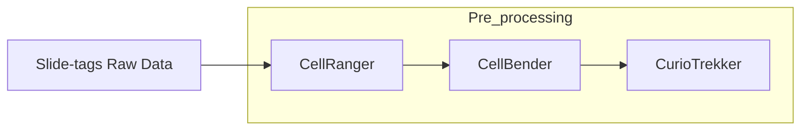

# Slide-tags_preprocessing

## Overview

Preprocessing of raw .fastq files from "Slide-tags" spatial transcriptomics experiments, using kits from Curio Bioscience.
This script includes 3 stages 



## Structure

- `CellRangerAutomation.py`: Script to run CellRanger, offered by 10x Genomics. Submits an sbatch script to a SLURM HPC.  
- `CellBenderAutomation.py`: Script to run CellBender , offered by 10x Genomics. Submits an sbatch script to a SLURM HPC. 
- `CurioTrekkerAutomate.py`: Script to run the CurioTrekker pipeline offered by Curio BioScience. Submits an sbatch script to a SLURM HPC. 

## Running the Analysis
Follow these steps after cloning the repository and navigating inside that directory

```bash
cd Slide-tags_preprocessing
```

### Part 1:  Install required software (semi-automated)

Make sure Nextflow is installed:
```bash
module load nextflow 
```
Run the setuf script:
```bash
nextflow run setup.nf -profile standard
```

### Cell Ranger Installation
CellRanger requires consenting to the 10x genomics terms & conditions:

1. Create a subfolder in your current directory (Slide-tags_preprocessing) and 'cd' into it.
```bash
mkdir CellRanger
cd CellRanger
```


2. Visit this link to download the pipeline: https://www.10xgenomics.com/support/software/cell-ranger/downloads 
Recommendation: Download the tar.gz compressed version then use the following to decompress:
    ```bash
    tar -xvzf cellranger-9.0.1.tar.gz
    ```

3. Install your reference of choice. Instructions can be found at: https://www.10xgenomics.com/support/software/cell-ranger/downloads
This is the command for the mouse GRCm39 genome:
    ```bash
    wget "https://cf.10xgenomics.com/supp/cell-exp/refdata-gex-GRCm39-2024-A.tar.gz" 
    ```
    Unzip the file after installation: 
    ```bash
    gunzip "refdata-gex-GRCm39-2024-A.tar.gz" 
    ```

Your file structure after running the setup module and installing cellbender should look like this: 

```bash
├── CellBender
│   ├── CellBender_github
│   │   ├── build_docker_local.sh
│   │   ├── build_docker_release.sh
│   │   ├── cellbender
│   │   ├── docker
│   │   ├── docs
│   │   ├── examples
│   │   ├── LICENSE
│   │   ├── MANIFEST.in
│   │   ├── pyproject.toml
│   │   ├── README.rst
│   │   ├── requirements-dev.txt
│   │   ├── requirements-rtd.txt
│   │   ├── requirements.txt
│   │   └── wdl
│   └── cellbender_latest.sif
├── CellRanger
│   ├── cellranger-9.0.1
│   │   ├── bin
│   │   ├── builtwith.json
│   │   ├── cellranger -> bin/cellranger
│   │   ├── env.json
│   │   ├── etc
│   │   ├── external
│   │   ├── lib
│   │   ├── LICENSE
│   │   ├── mro
│   │   ├── probe_sets -> external/tenx_feature_references/targeted_panels
│   │   ├── sourceme.bash
│   │   ├── sourceme.csh
│   │   └── THIRD-PARTY-LICENSES.cellranger.txt
│   └── cellranger-9.0.1.tar.gz
├── Containers
│   └── slide_tag_env_latest.sif
├── CurioTrekker
│   └── curiotrekker-v1.1.0
│       ├── cellbarcode_whitelists
│       ├── common
│       ├── curiotrekker-v1.1.0.sif
│       ├── environment.yml
│       ├── nuclei_locater_conda.sh
│       ├── nuclei_locater_docker.sh
│       ├── nuclei_locater_singularity.sh
│       └── nuclei_locater_toplevel.sh
└── References
    ├── Mouse
    │   ├── fasta
    │   ├── gene
    │   ├── star
    │   ├── reference.json
    └── refdata-gex-GRCm39-2024-A.tar.gz

```

### Part 2: Preprocess your data 
The scripts used assume that your raw data has the following structure: 

After running the scripts for at 1 sample, 3 new folders will be created: 
```bash
#TODO add tree
```


*credits to @hudsonhu22 for streamlining this whole process*