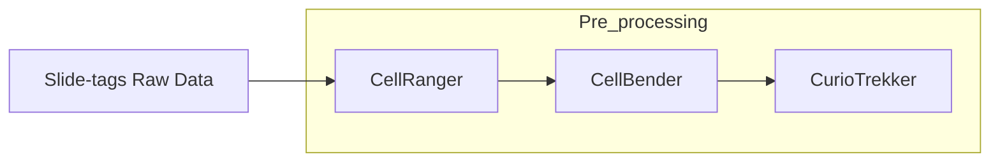

# Slide-tags_preprocessing

## Overview

Preprocessing of raw .fastq files from "Slide-tags" spatial transcriptomics experiments, using kits from Curio Bioscience.
This script includes 3 stages 



## Structure

- `CellRangerAutomation.py`: Script to run CellRanger, offered by 10x Genomics. Submits an sbatch script to a SLURM HPC.  
- `CellBenderAutomation.py`: Script to run CellBender. Submits an sbatch script to a SLURM HPC. 
- `CurioTrekkerAutomate.py`: Script to run the CurioTrekker pipeline offered by Curio BioScience. Submits an sbatch script to a SLURM HPC. 

## Running the Analysis
Follow these steps after cloning the repository and navigating inside that directory

```bash
cd Slide-tags_preprocessing
```

### Part 1:  Install required software (semi-automated)

Make sure Nextflow is installed:
```bash
module load nextflow 
```
Run the setuf script:
```bash
nextflow run setup.nf -profile standard
```

### Cell Ranger Installation
CellRanger requires consenting to the 10x genomics terms & conditions:

1. Create a subfolder in your current directory (Slide-tags_preprocessing) and 'cd' into it.
```bash
mkdir CellRanger
cd CellRanger
```


2. Visit this link to download the pipeline: https://www.10xgenomics.com/support/software/cell-ranger/downloads 
Recommendation: Download the tar.gz compressed version then use the following to decompress:
    ```bash
    tar -xvzf cellranger-9.0.1.tar.gz
    ```

3. Install your reference of choice. Instructions can be found at: https://www.10xgenomics.com/support/software/cell-ranger/downloads
This is the command for the mouse GRCm39 genome:
    ```bash
    wget "https://cf.10xgenomics.com/supp/cell-exp/refdata-gex-GRCm39-2024-A.tar.gz" 
    ```
    Unzip the file after installation: 
    ```bash
    gunzip "refdata-gex-GRCm39-2024-A.tar.gz" 
    ```

Your file structure after running the setup module and installing cellbender should look like this: 

```bash
├── CellBender
│   ├── CellBender_github
│   │   ├── build_docker_local.sh
│   │   ├── build_docker_release.sh
│   │   ├── cellbender
│   │   ├── docker
│   │   ├── docs
│   │   ├── examples
│   │   ├── LICENSE
│   │   ├── MANIFEST.in
│   │   ├── pyproject.toml
│   │   ├── README.rst
│   │   ├── requirements-dev.txt
│   │   ├── requirements-rtd.txt
│   │   ├── requirements.txt
│   │   └── wdl
│   └── cellbender_latest.sif
├── CellRanger
│   ├── cellranger-9.0.1
│   │   ├── bin
│   │   ├── builtwith.json
│   │   ├── cellranger -> bin/cellranger
│   │   ├── env.json
│   │   ├── etc
│   │   ├── external
│   │   ├── lib
│   │   ├── LICENSE
│   │   ├── mro
│   │   ├── probe_sets -> external/tenx_feature_references/targeted_panels
│   │   ├── sourceme.bash
│   │   ├── sourceme.csh
│   │   └── THIRD-PARTY-LICENSES.cellranger.txt
│   └── cellranger-9.0.1.tar.gz
├── Containers
│   └── slide_tag_env_latest.sif
├── CurioTrekker
│   └── curiotrekker-v1.1.0
│       ├── cellbarcode_whitelists
│       ├── common
│       ├── curiotrekker-v1.1.0.sif
│       ├── environment.yml
│       ├── nuclei_locater_conda.sh
│       ├── nuclei_locater_docker.sh
│       ├── nuclei_locater_singularity.sh
│       └── nuclei_locater_toplevel.sh
└── References
    ├── Mouse
    │   ├── fasta
    │   ├── gene
    │   ├── star
    │   ├── reference.json
    └── refdata-gex-GRCm39-2024-A.tar.gz

```

### Part 2: Preprocess your data 
The scripts used assume that your raw data has the following structure: 

```bash
/home/mfafouti/nearline/rrg-shreejoy/SlideTagData
└── GOY29355.20241128
    ├── BC13
    │   ├── cDNA
    │   │   ├── ST_BC13_cDNA_lib_S8_L006_I1_001.fastq.gz
    │   │   ├── ST_BC13_cDNA_lib_S8_L006_I2_001.fastq.gz
    │   │   ├── ST_BC13_cDNA_lib_S8_L006_R1_001.fastq.gz
    │   │   └── ST_BC13_cDNA_lib_S8_L006_R2_001.fastq.gz
    │   └── SP
    │       ├── ST_BC13_SP_lib_S2_L005_I1_001.fastq.gz
    │       ├── ST_BC13_SP_lib_S2_L005_I2_001.fastq.gz
    │       ├── ST_BC13_SP_lib_S2_L005_R1_001.fastq.gz
    │       └── ST_BC13_SP_lib_S2_L005_R2_001.fastq.gz
    ├── BC14
    │   ├── cDNA
    │   │   ├── ST_BC14_cDNA_lib_S9_L006_I1_001.fastq.gz
    │   │   ├── ST_BC14_cDNA_lib_S9_L006_I2_001.fastq.gz
    │   │   ├── ST_BC14_cDNA_lib_S9_L006_R1_001.fastq.gz
    │   │   └── ST_BC14_cDNA_lib_S9_L006_R2_001.fastq.gz
    │   └── SP
    │       ├── ST_BC14_SP_lib_S3_L005_I1_001.fastq.gz
    │       ├── ST_BC14_SP_lib_S3_L005_I2_001.fastq.gz
    │       ├── ST_BC14_SP_lib_S3_L005_R1_001.fastq.gz
    │       └── ST_BC14_SP_lib_S3_L005_R2_001.fastq.gz
```
*Note*: Make sure that the .fastq files are merged. 

After running the scripts for at 1 sample, 3 new folders will be created: 
```bash
├── output_folder
│   ├── CB_out
│   ├── CR_out
│   └── CT_out
```
The contents of the `CR_out` folder (after running 1 sample), containing the output of CellRanger, should look like: 

```bash
/home/mfafouti/scratch/Mommybrain_marlen/Slide_tags/SlideTagDataPipeline/Manual_processing/CR_out
└── BC13
    ├── BC13_20250404_110829
    │   ├── BC13_20250404_110829.mri.tgz
    │   ├── _cmdline
    │   ├── extras
    │   ├── _filelist
    │   ├── _finalstate
    │   ├── _invocation
    │   ├── _jobmode
    │   ├── _log
    │   ├── _mrosource
    │   ├── outs
    │   ├── _perf
    │   ├── _perf._truncated_
    │   ├── SC_RNA_COUNTER_CS
    │   ├── _sitecheck
    │   ├── _tags
    │   ├── _timestamp
    │   ├── _uuid
    │   ├── _vdrkill
    │   └── _versions
    ├── cellranger_BC13_42143780.err
    ├── cellranger_BC13_42143780.log
    └── sbatch_cellranger_BC13.slurm

6 directories, 19 files
```
The contents of the `CB_out` folder (after running 1 sample), containing the output of CellBender, should look like: 
```bash 
/home/mfafouti/scratch/Mommybrain_marlen/Slide_tags/SlideTagDataPipeline/Manual_processing/CB_out
└── BC13
    ├── cellbender_42392333.log
    ├── cellbender_BC13.log
    ├── output_file_cell_barcodes.csv
    ├── output_file_filtered.h5
    ├── output_file.h5
    ├── output_file.log
    ├── output_file_metrics.csv
    ├── output_file.pdf
    ├── output_file_posterior.h5
    ├── output_file_report.html
    ├── sbatch_cellbender_BC13.slurm
    └── sc_out
        ├── barcodes.tsv.gz
        ├── features.tsv.gz
        └── matrix.mtx.gz

3 directories, 14 files
```
*Note*: The sc_out folder is created through the `extract_sc_out.py` script. 

The contents of the `CT_out` folder (after running 1 sample), containing the output of CurioTrekker, should look like: 

```bash 
/home/mfafouti/scratch/Mommybrain_marlen/Slide_tags/SlideTagDataPipeline/Manual_processing/CT_out
├── ct_BC13ct_BC13_43089914.err
├── ct_BC13ct_BC13_43089914.out
├── log
│   └── BC13
│       ├── analysis.log
│       ├── beadbarcode_splitter.log
│       ├── bead_matching.log
│       ├── fastq_parser.log
│       ├── genmetrics.log
│       ├── genreport.log
│       ├── mismatch_analysis.log
│       └── spatial.log
├── ST_BC13_SP_lib_S2_L005_R1_001.fastq.gz
├── ST_BC13_SP_lib_S2_L005_R2_001.fastq.gz
├── withBenderSamplesheet_BC13_samplesheet_trekker.csv
└── withBendersbatch_curiotrekker_BC13.slurm

3 directories, 16 files
```

*Note*: The .fastq files in this folder correspond to the 1 sample that went through CurioTrekker. The corresponding container might not have access to other shared locations on an HPC where the data is usually stored. This means that the user needs to transfer the data to their working directory (in our case, in some location within $SCRATCH in SciNet's Niagara)


*credits to @hudsonhu22 for streamlining this whole process*
